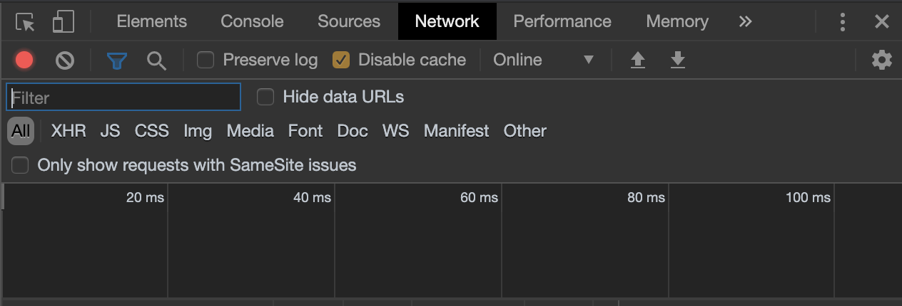

# React Splunk Integration using create-react-app

## Overview
Instructions for integrating a React front-end on a Splunk application. This tutorial is based off the initial [React Splunk Integration](react-splunk-integration.md) tutorial but removes the complications of the `babel` and `webpack` setup by using the `create-react-app` module. There will be a few overlaps regarding instructions, but the setup should be a lot quicker.

## Prerequisites
- Installed Splunk
- Installed NodeJS and NPM
- Splunk Application is created

# Instructions

## Step 1: Create your React app

1. Go to your Splunk Application directory
```
cd $SPLUNK_HOME/etc/apps/<my_app>
```
2. Create the `appserver/static` directory
```
mkdir -p appserver/static
```
3. Go to the `appserver/static` directory
```
cd appserver/static
```
4. Create your react application using `create-react-app`
```
npx create-react-app client
```
5. Go inside the `client` folder
```
cd client
```
6. Install `cra-build-watch` as a dev dependency
```
npm install --save-dev cra-build-watch
```
7. Add the `watch` script in your `package.json` file
```json
...
    "scripts": {
        ...
        "watch": "cra-build-watch --disable-chunks --public-path=/en-US/static/app/<my_app>/client/build/"
    }
...
```

*Note: Ensure that you attach the trailing slash, otherwise assets wouldn't load*

8. Run the `watch` script
```
npm run watch
```

## Step 2: Create your homepage (optional)

*Note 1: Skip this step if you already have a dashboard* 

*Note 2: This step assumes you're building from a bare Splunk app*

1. Open `$SPLUNK_HOME/etc/apps/<your-app>` in your IDE
2. Modify `default/data/ui/nav` to

```xml
<nav search_view="search">
  <view name="homepage" default='true' />
</nav>
```

3. Create a `homepage.xml` inside `default/data/ui/views`
4. Paste the following as the contents of your `homepage.xml`

```xml
<dashboard script="client/build/js/bundle.js">
    <label>Homepage</label>
    <row>
        <panel>
            <html>
                <div id="root">This is a placeholder div</div>
            </html>
        </panel>
    </row>
</dashboard>
```

## Step 3: Disable Splunk Caching

1. Create a file called `web.conf` inside your `default` folder
2. Enter the following settings:
```
[settings]
 js_no_cache = true
 cacheBytesLimit = 0
 cacheEntriesLimit = 0
 max_view_cache_size = 0
 auto_refresh_views = 1
```
3. Restart the Splunk server

## Step 4: Develop your Splunk UI
See `Appendix B`

# Appendix

## Appendix A: Restaring Splunk
**Note:** If you can't see the settings bar, go to `https://<SPLUNK_URL>/en-GB/manager/<APP>/control`

1. Open Splunk via your Web Browser
2. Log in
3. Go to `Settings > Server Controls`
4. Press `Restart Splunk`

## Appendix B: Developing the UI
When developing your React front-end, you need to have two things running:
1. The `watch` script
2. Browser developer console

You can run the `watch` script by typing `npm run watch` from your `react-ui` directory.

When you have the browser developer console open, ensure that you have **caching disabled**. For Chrome, this can be found in the `Network` tab. **You need to have the developer console open at all times, otherwise you wouldn't be able to see changes.**

