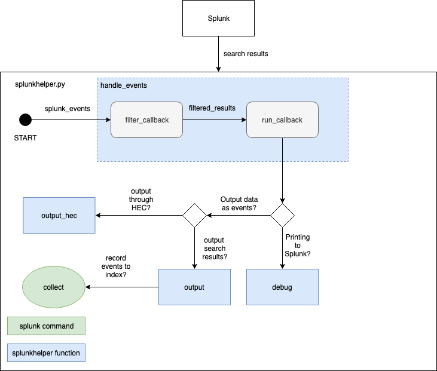

# Intersplunk Wrapper Script

[Download the script here](../code/splunkhelper.py)

## Overview
Splunk supports an internal library called `Intersplunk` to interact with the Splunk system, however it is very hard to use and it isn't documented anywhere. I created a script called `splunkhelper.py` to abstract away additional logic required to use Intersplunk and support intuitive functions for your code.

## Purpose
`splunkhelper.py` is used to handle events retrieved from Splunk in your code easily. It supports functions for:

1. Debugging
2. Performing Actions on Events
3. Pushing new events into Splunk

## Functions
| Function | Version | Description|
|:-----|:-----|:-----|
| `debug(message:any)` | 1.0 | Displays the message as an error message into splunk. The message is displayed underneath the search box in the Splunk search view |
| `output(data: any)` | 1.0 | Pushes the data into Splunk as events. Can be used with the `collect` command to push the new events into an index
| `handle_events(run_callback: Function [, filter_callback: Function])` | 1.0 | Handles Splunk events pushed into the script through a `run_callback` function. The **optional** `filter_callback` function is used to filter specific properties from Splunk event objects. The output of the `filter_callback` function is used as an input in the `run_callback` function. Both callback functions take one argument.
| `get_objects(splunk_events: array [, additional_fields: array])` | 1.1 | Retrieves the objects with properties from the `raw` field of the splunk events. You can extract additional fiields through the `additional_fields` argument.
| `output_hec(splunk_url: string, hec_token: string, data: any [, index: string, has_nginx: bool])` | 1.2 | Sends the data into Splunk as events through the HTTP Event Collector endpoint. If the Splunk server has an nginx proxy, the script assumes that a `/splunkHEC` endpoint exists, which then forwards data to the default HEC port. If `has_nginx` parameter is false, it sends data to the default HEC port (8088) instead.

## General Logic Flow



## Library Limitations
When using the `get_objects` function in your filter callback, ensure that all values for each key in your data **do not have the '=' symbol** inside it. It will mess up how key-value pairs are created. If you **do** use the `=` symbol, you're better off creating an array which specifies the fields you want to extract. See general playbook as a guide.

## General Usage Playbook

### Print Splunk Events
This is the simplest script you can create using splunkhelper. It takes splunk search results, and then prints it underneath the search results as error messages.

#### print.py
```python
import splunkhelper

def FilterCallback(splunk_events):
    return splunk_events

def RunCallback(filter_events):
    splunkhelper.debug(filter_events)

splunkhelper.handle_events(RunCallback,FilterCallback)
```

#### commands.conf
```
[print]
overrides_timeorder = true # used so that splunk does not complain about time ordering
filename = print.py
```

### Collecting Data to Index
#### Splunk Search Query
```
<search_query> | script <my_script> | collect index="<my_index>"
```

##### Notes

1. The `search_query` can be your standard search query

2. `my_script` should match the name defined in your `commmands.conf` file

3. `my_index` is the index you want to put script outputs in

4. You can remove the `collect` pipe if you want the output to be printed inside the results view.

### Pushing Multiple Events into Splunk
The output function uses Intersplunk's `outputResults` function. The `outputResults` function print two "events" into splunk; the first event is the header, and the second event is the data associated to the headers. When you're pushing multiple events, **make sure that you push all the objects into an array first before you pass it into the output function**. This prevents the headers being pushed into your splunk index when collecting the results.

*Example*
```python
import splunkhelper
 
def RunCallback(filtered_results):
    logged_events = []
 
    for result in filtered_results:
        log_data = _DoStuff(result)
        logged_events.append(log_data)
 
    splunkhelper.output(logged_events)
 
splunkhelper.handle_events(RunCallback)
```

### Extracting Fields From Splunk Events
*Example 1: Use `get_objects` to extract properties from splunk events without a hard-coded array*

Pros:
- Extracted fields are specified by the splunk search query results
- Easily maintainable code

Cons:
- Some restrictions when handling `stash` data formats

```python
import splunkhelper
 
def FilterCallback(splunk_events):
    # it is optional to include additional fields
    # use this if you want to retrieve splunk event properties like _time in your data
    additional_fields = [...]
    return splunkhelper.get_objects(splunk_events, additional_fields)
 
def RunCallback(filter_results):
    # Do stuff
 
splunkhelper.handle_events(RunCallback, FilterCallback)
```

*Example 2: Specify fields you want extracted*

Pros:
- Clear idea on what the data will look like
- Can filter out unnecessary data
- Do not have to handle restrictions when handling splunk envets in stash data format

Cons:
- Harder to maintain
- Have to synchronise splunk field names with the extracted field names

```python
import splunkhelper
 
def FilterCallback(splunk_events):
    filter_results = []
    # list all properties extracted from the splunk event
    # NOTE: the properties are case sensitive
    extracted_fields = [...]
 
    for event in splunk_event:
        data = {}
        for field in extracted_fields:
            if field in event:
                data[field] = event[field]
        filter_results.append(data)
 
    return filter_results
 
def RunCallback(filter_results):
    # Do stuff
 
splunkhelper.handle_events(RunCallback, FilterCallback)
```

### Defining HEC IP Addresses
If you Splunk server has an nginx proxy, then the script assumes that a `splunkHEC` endpoint exists to handle HEC data. The HEC data can be sent through a url that looks like this:

```
https://<mysplunkurl.com>/splunkHEC/services/collector/events
```

If you Splunk server does not have an nginx proxy, HEC data needs to be handled through the default Splunk HEC port (8088). If you're sending HEC data locally, you can set the ip address to 127.0.0.1.

[Download the script here](../code/splunkhelper.py)